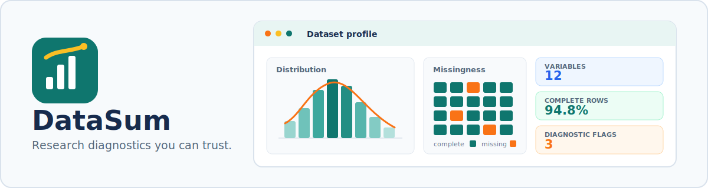

<p align="center">
  
</p>

<p align="center">
  <a href="https://github.com/Uzairkhan11w/DataSum/actions/workflows/R-CMD-check.yaml"></a>
  <a href="https://CRAN.R-project.org/package=DataSum"></a>
  <a href="https://github.com/Uzairkhan11w/DataSum/pulls"></a>
</p>

<p align="center"><strong>From first look to reproducible report.</strong></p>

DataSum is an R toolkit for rigorous first-pass data diagnostics. It helps
statisticians, researchers, professors, scientists, and students move from a
raw data frame to transparent summaries, quality warnings, distribution checks,
group comparisons, and reproducible reports.

> **Release status:** GitHub contains the new DataSum 1.0 API. CRAN currently
> serves the legacy 0.1.1 release, so install from GitHub to use the functions
> documented below.

## Start in 60 seconds

```r
install.packages("remotes")
remotes::install_github("Uzairkhan11w/DataSum")

library(DataSum)

summary <- summarize_data(iris, by = "Species", digits = 3)
profile <- profile_data(iris)
profile$warnings
```

## What DataSum gives you

| Capability | What it answers |
|---|---|
| NA-aware summaries | How much usable data is present in every variable? |
| Robust statistics | What do median, IQR, MAD, skewness, and excess kurtosis reveal? |
| Mode handling | Are there tied modes, and how frequent are they? |
| Outlier diagnostics | Which variables exceed the transparent 1.5 x IQR rule? |
| Normality diagnostics | Which test ran, what was its p-value, and what does the decision mean? |
| Grouped profiles | How do variables differ across treatments, classes, or cohorts? |
| Analyst warnings | Which missingness, duplicate, outlier, or distribution issues need attention? |
| Reproducible reports | Can the diagnostic record be shared as Quarto HTML, PDF, or DOCX? |
| Interactive app | Can a non-programmer upload a CSV and explore the same diagnostics? |

## Clean 1.0 API

| Function | Purpose |
|---|---|
| `summarize_vector()` | One-row diagnostic summary for a single vector |
| `summarize_data()` | One row per variable, optionally within groups |
| `profile_data()` | Dataset overview, variable summaries, and warnings |
| `datasum_report()` | Quarto diagnostic report source and optional rendering |
| `run_datasum_app()` | Interactive Shiny interface |

## Try the diagnostics

```r
summarize_vector(
  c(12, 14, 14, 16, NA, 21, 45),
  name = "response_time",
  digits = 2
)

summarize_data(iris, by = "Species", digits = 2)

profile <- profile_data(airquality, digits = 2)
profile$dataset
profile$summary
profile$warnings
```

Normality output is deliberately cautious. DataSum reports **evidence against
normality** or **no evidence against normality**; it does not claim that a
sample has proven a population distribution.

## Launch the app

```r
run_datasum_app()
```

The Shiny app opens in your browser and provides:

- CSV upload
- dataset and variable diagnostics
- warning tables
- numeric histograms and categorical bar charts
- downloadable Quarto report source

This launches locally on your computer. A public hosted version is part of the
project roadmap.

## Create a reproducible report

Create a portable Quarto source file without extra software:

```r
report <- datasum_report(
  iris,
  path = "iris-diagnostic-report.qmd",
  format = "qmd",
  render = FALSE
)
```

With the optional `quarto` package and Quarto CLI installed, render directly:

```r
datasum_report(
  iris,
  path = "iris-diagnostic-report.html",
  format = "html",
  render = TRUE
)
```

The report contains the dataset overview, variable diagnostics, analyst
warnings, formula definitions, and interpretation guidance.

## Designed for trust

- Tested by GitHub Actions on current R releases for Linux, Windows, and macOS
- Deterministic tied-mode output
- Safe behavior for missing, empty, constant, and non-numeric vectors
- Explicit formulas and thresholds
- No silent two-decimal rounding
- Source, tests, documentation, and roadmap kept in public

## Project links

- [Roadmap](https://github.com/Uzairkhan11w/DataSum/blob/master/ROADMAP.md)
- [Contributing guide](https://github.com/Uzairkhan11w/DataSum/blob/master/CONTRIBUTING.md)
- [Support](https://github.com/Uzairkhan11w/DataSum/blob/master/SUPPORT.md)
- [Security policy](https://github.com/Uzairkhan11w/DataSum/blob/master/SECURITY.md)
- [Code of conduct](https://github.com/Uzairkhan11w/DataSum/blob/master/CODE_OF_CONDUCT.md)
- [CRAN release checklist](https://github.com/Uzairkhan11w/DataSum/blob/master/CRAN-RELEASE.md)
- [Changelog](https://github.com/Uzairkhan11w/DataSum/blob/master/NEWS.md)
- [Citation metadata](https://github.com/Uzairkhan11w/DataSum/blob/master/CITATION.cff)

## Citation

GitHub displays a **Cite this repository** button from `CITATION.cff`. From R,
you can also run:

```r
citation("DataSum")
```

## Community

DataSum is being built in public. Bug reports, statistical-method discussions,
teaching use cases, documentation improvements, and research workflow ideas are
welcome through [GitHub Issues](https://github.com/Uzairkhan11w/DataSum/issues).

DataSum is diagnostic software, not a substitute for study design, domain
expertise, or model-specific assumption checking.
